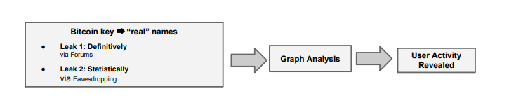
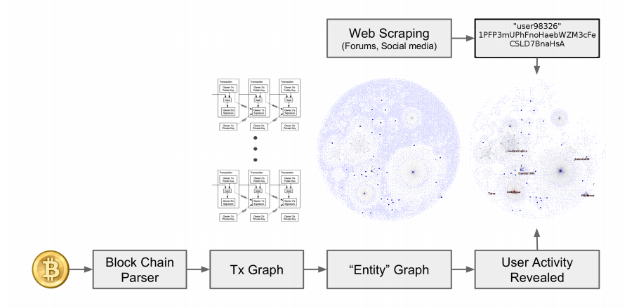

# Bitcoin Transaction Graph Analysis
<h6> Michael Fleder, Michael S. Kester, Sudeep Pillai  </h6>  

<h6>[Background and Problem]</h6> 
Bitcoin has gained popularity over a period of time in terms of trading electronically using cryptocurrency. It uses a public distributed ledger to keep track of all the transactions in Bitcoin network. In Bitcoin blockchain system, users are identified based on their cryptographic public addresses. This feature made users think that their anonymity is preserved. However, some recent studies prove that it certainly has some privacy concerns. In this paper, authors try to break anonymity in Bitcoin systems using graph analysis. The authors first try to link public keys to actual user’s names and then create a users graph and come up with a summary of users activity which can help any attacker to break the privacy

<h6>[Methodology]</h6> 
In the threat model used for research, it is assumed that attacker has access to all the information available online and attacker can overhear transactions which may not be 100% accurate. Following methods were used to find the data: 
* Scraper is used to fetch information such as Bitcoin addresses from public forums available on web which is shared by users willingly or unwillingly. Usernames available in  public forums were then linked with their Cryptographic Bitcoin addresses
* That information is then linked to the transactions in Bitcoin.

  
 <b>Figure 1</b>: <i>Attack Model</i>[2]</i>

<h6>[Implementation]</h6> 
The implementation includes Preprocessing of data in Bitcoin Blockchain and Transaction fingerprinting.

* Preprocessing of Data
  * Bitcoin Blockchain is downloaded and its data is parsed using a tool called Armory to retrieve information required to build a graph.
  * A python package called Scrappy is used to fetch information from web forums via a crawler which fetches information from bitcointalk.org in breadth-first manner. Fetched information is verified with data parsed in step 1. The result of this step is the identification of large number of users. Code was run for less than 30 hours and a total of 222 users were identified with their overall 2404 addresses.

* Transaction fingerprinting
  * Matching the roughly overheard transactions with actual transactions in Bitcoin blockchain. The amount is first converted using daily market price from [1]. The overheard amount is compared with an approximation of +- $1 in the blockchain and time of the transactions is approximated to +- 5 minutes. 
 
 <h6>[Graph analysis]</h6> Metrics evaluated from graph analysis are: most important nodes in the network, the assets of these nodes, the movement of assets between nodes, nodes having high number of transactions.  
 Transaction graph was created to determine the flow of bitcoins from one public id to another public id. Transaction graph also helped to link multiple addresses to one user. 
 User graph was created where each user has all the addresses linked to it. Nodes in user graph representing real users and link between nodes representing the transaction happening between two users.  
 
 
  
 <b>Figure 2</b>: <i>The graph analysis pipeline that was used to reveal user identity constructs a user network graph
as shown, and annotates the users in the graph with web scraped results[2].</i>  

 
 * PageRank algorithm is used to find the some of the interesting users based on their activities and the transactions made by them.
 * User De-anonymization i.e identities of some of the interesting users were revealed.
 
 The analysis was done for transaction occurred on Oct 25, 2013. 
 The transaction graph built for that day had 89,806 transactions among 80,030 different public addresses. The user graph had 54,941 nodes with 89,806 edges[2].

  <h6>[Results]</h6> The authors were able to link the transactions associated with SatoshiDICE and Wikileaks. They were also able to link users in forum with nodes belonging to Silk Roads. It is hence proved in the paper that the system is not entirely anonymous.

<h6>[References]</h6>
[1] https://blockchain.info/charts/market-price, December 12, 2013 
[2] Bitcoin Transaction Graph Analysis, Michael Fleder, Michael S. Kester, Sudeep Pillai, 2015
