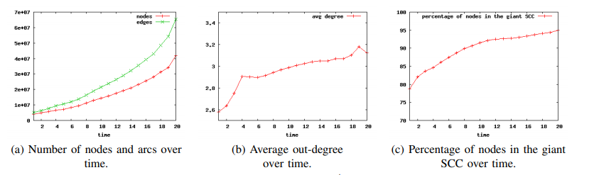
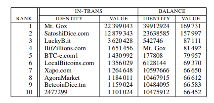

# Uncovering the Bitcoin blockchain: an analysis of the full users graph
<h6> Damiano Di Francesco Maesa, Andrea Marino, Laura Ricci,  October 2016 </h6>  

<h6>[Background and Problem]</h6> 
With advancement of digital technology, every person is able to connect to every other person directly for information exchange. But so is not the case for financial exchange. Various cryptocurrencies were proposed earlier that can be used for online transactions but did not succeed due to lack of complete decentralization. But later, this direct exchange became possible with the commencement of Bitcoin Blockchain. In this paper, the authors take a deep insight to find the time-evolution of Bitcoin and also validate the conjecture ”rich gets richer” with respect to Bitcoin users. They also determined the most critical users/nodes in Bitcoin network using graph analysis. The main focus of study was to build transaction graph using Bitcoin data. It is mentioned in the paper that all the previous work was done on data present till 2013 which had almost 10 million transactions but a huge jump in the number of transactions was seen after that which took the total number to more than a 100 Million. The authors used this data in their experiment.

<h6>[Methodology]</h6> 
The properties and Lemmas followed in the paper to build User Graph is as follows:

 * A is the set of all addresses and T is the set of all transactions in Bitcoin.
 * Property 1. For every two addresses x and y, if there exists a transaction (A1, A2) where x, y ∈ A1, then x and y belong to a same cluster[1]. Here A1 and A2 are subsets of A.
 * Lemma 1. Given H = (A, T), the clustering corresponding to the connected components C1, . . . , Ck of GH satisfies Property 1[1]. Each cluster contains addresses belonging to a particular user. The union of addresses in all clusters C1, C2,...Ck will contain all addresses in A.
 * Lemma 2. G'H and GH have the same connected components[1].
 * Transactions that contained p2pkh, p2pk and p2sh types of scripts were taken into consideration. Rest were ignored. These transactions covered 99.4977% of all the transactions[1]. 

<h6>[Implementation]</h6> 
A weighted directed graph H=(A,T) is generated using Bitcoin dataset. Each transaction T can be transformed as an ordered pair(A1,A2) where A1 is a set containing input addresses and A2 is a set containing output addresses for that transaction. Other information associated to a transaction are timestamp of the transaction, amounts going to each address in A2, and mining fee. Using this weighted graph, a directed multigraph G is created for which the algorithm is given in the paper. 
 
 <h6>[Analysis and Results]</h6>
 For analysis, the properties of graph G created in implementation is taken into consideration. A symmetrical version U of G is also analyzed. Graph U is undirected version of    G.
 
* Connectivity Analysis Over Time
  * Densification: The evolution of G and U is analyzed.

 
 
  
 <b>Figure 1</b>: <i>Densification[1].</i>  

Figure 1(a) shows that the number of nodes increased over time. Figure 1(b) shows that the number of transactions increased faster than number of nodes and Figure 1(c) shows the number of nodes getting added to strongly connected component also increased over time. 

     
 * Centrality Analysis: Table 1 below shows 10 most important nodes in U of Bitcoin blockchain.
   
  <b>Table 1</b>: <i>THE TOP 10 CENTRAL NODES ACCORDING TO HARMONIC CENTRALITY IN Ut, DEGREE IN Ut, IN-DEGREE AND OUT-DEGREE IN Gt FOR THE LAST SNAPSHOT, I.E. t = 20. FOR THE UNKNOWN IDENTITY WE REPORT THE NUMBER OF THE IDENTIFIER IN OUR DATASET[1].</i>  
  
 * Rich get Richer and Concentration of Richness: Richness in terms of balance and connectivity is analyzed for the nodes in G. From the analysis following conclusions were made:
   * The richest users at time t are richer than the richest users at time t' < t.
   * The richest users at a certain time t tend to remain the richest at time t' > t.
   * The richness gets more concentrated with the progression of time.
Table 2 below shows the richness of top 10 nodes in terms of their balance.

  
 <b>Table 2</b>: <i>THE TOP 10 RICHEST NODES IN Gt WITH t = 20 [1].</i>  

<h6>[References]</h6>
[1] https://blockchain.info/charts/market-price, December 12, 2013 
[2] Bitcoin Transaction Graph Analysis, Michael Fleder, Michael S. Kester, Sudeep Pillai, 2015
