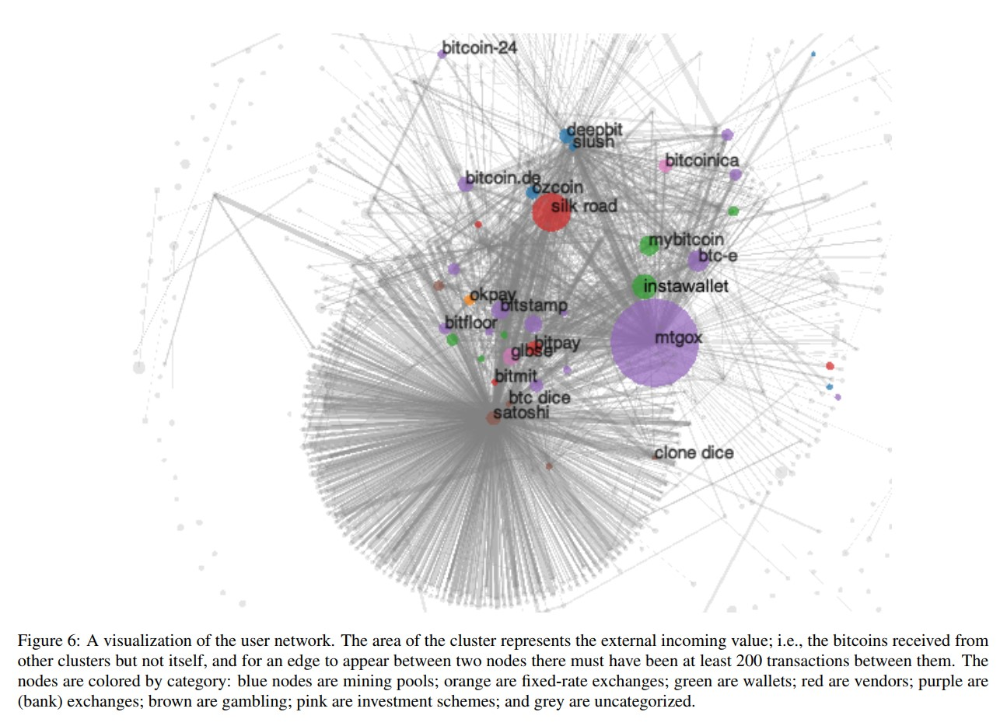

# BDA 7570/4060 Class Note- 01 chowdh26@myumanitoba.ca

A Summary of the Internet Measurement Conference 2013 research paper,‘A Fistful of Bit-
coin: Characterizing Payments Among Men with No Names’ by Sarah Meiklejohn,
Marjori Pomarole, Grant Jordan, Kirill Levchenko, Damon McCoyy, Geoffrey M. Voelker and
Stefan Savage.

1. **Introduction**

Bitcoin is one of the most popular crptocurrencies till days which provides its users to do
transactions while preserving their identities. By observing this psedonymity, authors of this
paper implemented heuristic clustering and re-identification attacks on the collected clusters to
detect shared authorities of Bitcoin wallet and classify operators. This clustering allows them to
amplify the results of their re-identification attack. If they can label one public key as belonging
to a user, they can transitively infer that the cluster containing this public key as belonging
to user as well. Where this approach differs from other paper, the graph in this paper is more
condense because of the clustering of user and it is easier to manipulate and derive information,
from which the authors represented longitudinal characterization of Bitcoin network.

2. **Background of the Bitcoin Blockchain**

Since the first introduction in 2018, Bitcoin is paving the path of the decentralized digital
cryptocurrency. Bitcoin transaction- a cryptographically signed and maintained via global peer-
to-peer network, which represents two main characteristics of Bitcoin: Anonymity and no need
of central authority. This psedonymity is established with the use of a pair of public and private
key. Still a issue remain which is double spending where the user can spend his transaction
twice illicitly. To prevent this Bitcoin introduced the concept of timestamp and the as the next
block is referring to the first one the block themselves create a chain. So if an attacker tries
to takeover the entire chain and broadcast false message they have to compute all the previous
hashes and have more computational power than the miners. In addition to that answer who are
miners, miners are individuals who try to solve the proof-of-work of a block and try to validate
a block against some rewards. Nowadays as the nonce (a SHA 256 hashed value) needs more
computational power to solve few miners are joining mining pools to increase the computational
power.
Along with mining the coins, users can also purchase bitcoind via exchanges (Mt. Gox) and
wallet services (MyBitcoin and Instawallet, inactive due to thefts). To spend the bitcoins, users
can spend it in gambling platform like Satoshi Dice, or buy items from vendors such as, Bitmit,
Tor-based service like Silk Road. Furthermore, in the earlier times users used to hoard bitcoins
rather than spending which left only 4 million bitcoins in the circulation among the 20 millions.
Another important observation is, as in recent times transactions are smaller and faster this
leads to the conclusion that these transactions belong to single service, Satoshi Dice, which was
later supported by the longitudinal study of Bitcoin.

3. **Motivation of The Study**

The psedonymity Bitcoin promises to provide has drawn attraction of illicit users over time in
terms of money laundering and fraud engagement. For example, Silk Road, a widely publicized
service using Bitcoin to trade illegal goods. As, Bitcoin network is growing quickly it is impor-
tant to understand the evolution over time.
The goal of this paper is not to generally deanonymize the users rather detect certain character-
istics present in concrete Bitcoin network implementations that can can weaken the anonymity
of users who engage in the network.

4. **Datasets and Clustering Heuristics**

To collect the data, authors had interacted with different sources to tag public keys, starting
with mining pools, wallets, vendors, gambling sites, exchanges and some laundry services. They
sought to “tag” as many addresses as possible this means that they label an address as being
definitively controlled by some known real-world user. By tagging the addresses it helped the
authors to develop a more compact graph for analysis. This paper took part in bitcoin transac-
tions(344 transactions) directly to the merchants which gave them the opportunity to tag more
precisely rather only relying publicly available addresses.
Next, the authors present two heuristics for linking the addresses which are used by the same
user in order to link all the public keys under a larger entity.
Two heuristic approaches are:

- The first heuristicidentifies a user by putting different keys as input to a transaction.
    If two or more public keys are used as inputs to the same transaction, then we say that
    they are controlled by the same user. Using this heuristic the authors partitioned the
    network into 5,579,176 clusters of users that is almost 54% of less of the value they
    started with.
- The second heuristicis based on changed addresses. ‘Changed addresses’(if there
    are any excess amount from the transaction, it is send back to the sender again) which
    provides new observation of the network. While explaining the second heuristic, the
    authors compared the change address and ‘shadow address’(referring to another paper’s
    heuristic) and why the assumption of not sending bitcoins to two different users don’t
    exist anymore.

In addition, the term ‘idiom of use’ is explained, which is mainly the addresses that accept
payments. Despite having some drawbacks authors of this paper tried to refine the second
heuristic to avoid super-cluster.

5. **Summary of Contributions**

The authors of this paper tried to link the input addresses together to detect same users of
a transaction where two or more public keys are used as inputs in that same transactions.
Furthermore, the authors studied the role of change addresses within the Bitcoin system and
second heuristic of this paper based on this.
Due to the lack of robustness second heuristic was refined because,

- Change address were being used twice, if the change address is used the second time
    with a new address the new address would be falsely labelled as a change address.
- Address would be used as a “self-change address” and then also used as a change address.

6. **Service Centrality and Findings**

In terms of centrality this paper analyzed centrality of both Satoshi Dice and exchange services.
The user graph of this Figure 6: draw two important parts, one the component consisting of
Satoshi Dice and the other services that interact with it along the heavily connected components
containing most of the services tagged by the authors. The authors argued that the demon-
strated centrality of these services make it difficult to be attracted to the anonymity properties
of Bitcoin even to the illicit users.For criminals, this centrality presents a unique problem: if a
thief steals thousands of bitcoins, this theft is unavoidably visible within the Bitcoin network,
and thus the initial address of the thief is known and he cannot simply transfer the bitcoins
directly from the exchange.

One of the movement criminals uses is known as peeling chain. In the criminal activities when
a large amount of BTC has stolen, criminals try to divide them into smaller transactions thus create the peeling chain. A smaller amount is then “peeled” off this larger amount, creating a transaction in which a small amount is transferred to one address and the remainder is transferred to a one-time change address. This process is repeated potentially for hundreds or thousands of hops until the larger amount is pared down, at which point (in one usage) the amount remain.
Later on using this change address and peeling chain of heuristic 2 this paper studied some
popular services to track illicit activities and found promising results about Silk Road.

    

7. **Future Direction**

The authors of this paper has developed new clustering heuristics based on change address and
Heuristic 1 to better cluster users. Using transaction that were tagged they identify interactions
between clusters/user. With this experiment it is easy to see that light has been shed on the
structure of the Bitcoin economy.
The work of this paper reflected the current gap between the actual and potential anonymity,along
with the curiosity how this gap might evolve over time, and what steps can be taken to achieve
stronger privacy. The analysis of the heuristics proposed by the authors is still an open problem
and may motivate to do more research works.

