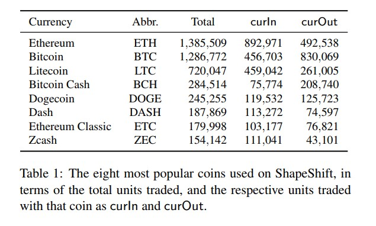
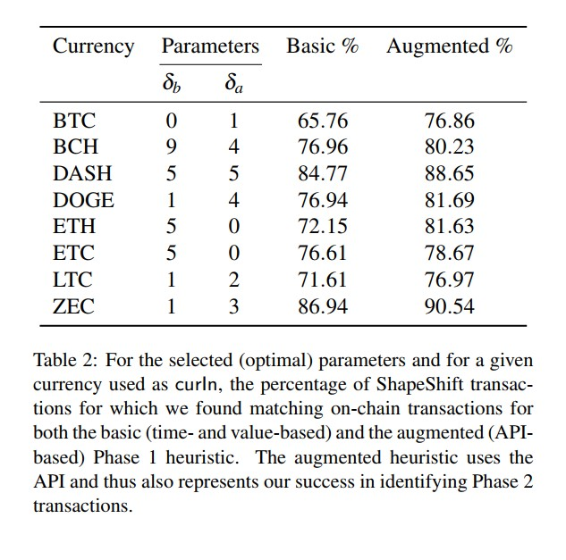
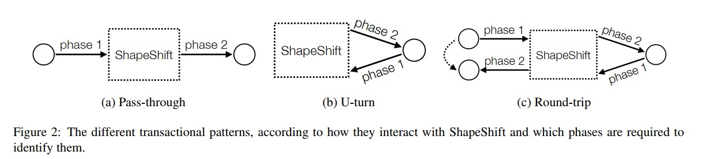
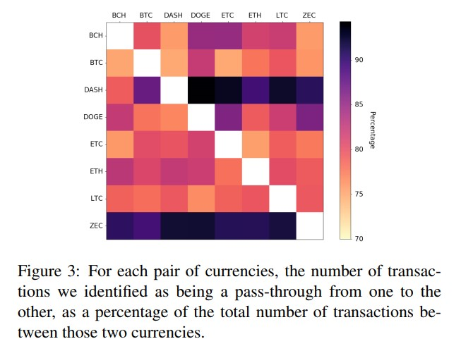

# BDA 7570/4060 Class Note- 02 chowdh26@myumanitoba.ca

A Summary of the USENIX Security Symposium 2019, research paper,‘Tracing Transactions Across Cryptocurrency Ledgers’ by Haaroon Yousaf, George Kappos, and Sarah
Meiklejohn.

1. **Introduction**

Bitcoin is one of the most popular cryptocurrencies which has attracted many illicit activities as
well. With prior research it is already proved, Bitcoin doesn’t provide the best anonymity and
this motivated the rise of many privacy enhanced coins. However, in this paper, the authors
tried to trace this money flow not only within the ledger of a single cryptocurrency but also
across the ledgers of different currencies. With this purpose the authors studied cross-currency
trading platforms and how they interact with different cryptocurrencies. The gained insights
from this research paper is discussed further in following.

2. **Background of Cryptocurrencies and Trading Platforms**

Cryptocurrencies have the properties of anonymity and decentralization which has con-
tributed the popularity of this types of currencies. Bitcoin being the first decentralized cryp-
tocurrency has motivated inventions of other platforms with more functionalities. For example,
Ethereum, Monero, Zcash and many other platforms are developed based on the Bitcoin archi-
tecture.
Digital asset trading platformscan store any money of the users without making them cre-
ate any account with the platform. This provides the ease of trading different cryptocurrencies.
The users keep their own money in their own account and the platform can only access it at the
time when the transaction has occurred. In this type of currency trading the users approach the
services and provide their preferable input currency and output currency. When the destination
address is specified by the user, the trading service present its exchange rate, an address to send
the money and a miner fee. Two best platforms are ShapeShift and Changelly which support
this type of trading.

3. **Motivation of The Study**

As prior researches has shown that it is possible to deanonymize the pseudonymity level in Bit-
coins, since then many privacy-enhanced currencies are being introduced (e.g. Monero, Zcash).
Unfortunate for the illicit users, even in these platforms it is possible to detect the money flow.
Where exchange mechanism may have certain risks, such as theft or lost of coins, an alternative
approach is trading platforms. Because of the bloom of cryptocurrencies, these trading plat-
forms offer the ease of exchanging different currencies. This rises a new insight in terms of illicit
activities and opened new possibilities to detect the money flow not only within the ledgers but
also across it.
The goal of this paper is to ‘explore the usage of cross currency trading platform and the poten-
tial they offer in terms of ability to track flow of coins as they move across different transaction
ledgers.’ This is important because illicit users and criminals try to hide their money flow using
these trading platforms and the ability to track will help to prevent future attacks.

4. **Datasets and Statistics**

This paper relied on three types of data sources:

- Changelly
- ShapeShift
- Blockchain data

This paper focused on top eight cryptocurrencies from ShapeShift, which were, Ethereum, Bit-
coin, Litecoin, Bitcoin Cash, Dogecoin, Dash, Ethereum Classic and Zcash. Then, to scrape the
data from these platforms the authors used BlockSci tool and Python scripts and stored it as
Apache Spark parquet files. The authors downloaded transactions and rates every 5 seconds for
close to 13 months from November 2017 to December 2018 which resulted in a set of almost 3
million distinct transactions.

    

5. **Identifying Transactions and Tracking Cross-currency Activities**

This paper focuses on detecting transactions among the traded currencies and for that first, the
authors implemented heuristics to detect those on chain transaction ans later examined what
types of insights can be found from the obtained results. To understand these cross currency
trades, details on the following two phases are important.

- curIn blockchain, which is the deposit of coins from the user to service.
- curOut, withdraw coins from the service to the users.

To identify correctly the deposit transactions, it is needed to identify the correct on-chain trans-
actions, which happened close in-time to the advertised on the API and same amount also as
advertised. Under a given timestamp of the transaction, at some height range curIn is specified.
With augmenting the API with this heuristic the percentage of detecting went to 76.86% from
65 .75%. To visualize the results of heuristic and the augmented heuristic we can look into the
table 2: Furthuremore, the authors tried to detect more complicated patterns in both curIn and
curOut blockchains. Three types of patterns to look into, Pass-through, U-turn and Round-trip,
which provided insights how money flows across the ledgers of different cryptocurrencies. From
this Figure 2, we can explain these transnational patterns:

- **Pass-through** transactions represent the full flow of money as it moves from one cur-
    rency to another via the deposit and withdraw transactions. Identification of this trans-
    action allowed the authors to create a link between the input addresses in a deposit in
    the curIn blockchain and the output address in the withdrawal on the curOut blockchain.
- **U-turn** transactions allow users to shift back immediately from one currency. Iden-
    tification of this transaction allowed the authors to see when the user has interacted
    with shapeShift. Because they were interested in holding units of the coral currency but
    because they see other benefits shooting coins back and forth.
- **Round-trip** transactions, combination of first two with the ability follow a user’s   flow
    of money between currencies and then back to origin. Identification of this transaction
    allowed the authors to see to create a link between the input address in the deposit on the curIn blockchain with the output addresses in the little withdrawal on the curIn blockchain.

    

    

6. **Clustering Analysis and Case Studies**

To understand the patterns of these trading platforms authors of this paper first implemented the
standard, multi-input clustering heuristic which provided unsatisfactory results and motivated
the authors to implement a new clustering heuristic,
**Common relationship heuristic**, ‘If two or more addresses send coins to the same address in
the curOut blockchain, or if two or more addresses receive coins from the same address in the
curIn blockchain, then these addresses have some common social relationship.’
Authors have applied this heuristic while studying two case studies(e.g. Starscape capital and
Ethereum-based scams) based on criminal activities to identify how this platform leveraged
such activities along with trading platforms interaction with trading bots and privacy coins
(e.g. Monero, Zcash and Dash).

    

7. Findings and Future Direction

This paper implemented their methodology to present a characterization of the cross-trading
platforms and tried to find links between ledgers of multiple different currencies. This paper
was successfully able to capture complex patterns within the transactions. Here, Figure 3 is a
visualization of such pattern for pass-through transaction, Future works can be done by finding more new complex patterns within other cryptocurrencies and how the cryptocurrencies can improve their privacy on cross-trading platforms.

